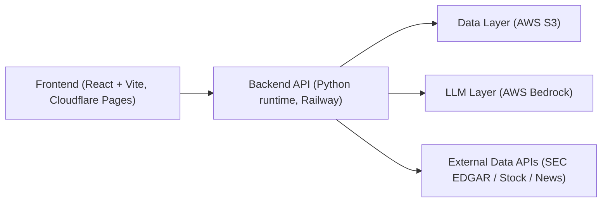

# RiskLensAI 项目技术总结（PROJECT_TECHNICAL_SUMMARY）

## 1) 整体架构概览（Cloudflare Pages + Railway + S3 + Bedrock）

架构关系（简述）：

- Frontend 部署在 Cloudflare Pages，负责页面渲染、交互、状态管理，通过 `VITE_API_BASE_URL` 调后端 `/api/*`。
- Backend 部署在 Railway，核心入口是 `agentcore_deploy/main.py`，负责 Upload/Records、Dashboard、Compare、Stock、News、Agent Chat、Tables 等 API。
- Data Layer 使用 AWS S3，保存 filings 原文、风险提取结果、agent report、tables 结果、index 与部分 cache。
- LLM Layer 使用 AWS Bedrock，双模型分工：
  - `BEDROCK_AGENT_MODEL_ID`（默认 `deepseek.v3-v1:0`）：对话编排 / ReAct orchestration / final answer。
  - `BEDROCK_EXTRACTION_MODEL_ID`（默认 `us.amazon.nova-pro-v1:0`）：结构化提取、分类 fallback、三维评分与报告生成。

---

## 2) 数据管道（Data Pipeline）

端到端链路：

1. **SEC EDGAR 下载**  
   `core/sec_edgar.py` 通过 SEC API 与归档地址下载 10-K HTML/PDF（auto-fetch 模式）。

2. **HTML/PDF 解析**  
   `core/extractor.py`：
   - HTML：edgartools/sec-parser/BeautifulSoup 多层 fallback 定位 Item 1 / Item 1A。
   - PDF：Textract 提取文本后走同样 Item 1A 风险解析逻辑。

3. **Bedrock 提取风险因子**  
   `extract_item1a_risks_bedrock` + `extract_item1_overview_bedrock` 产出结构化风险与 overview。

4. **自由分类 + dashboard 映射**  
   在 `main.py` 中先做 rule-based 9 类映射（keyword + tie-breaker），低置信度（`score < 2`）走 LLM fallback，最终统一到固定 dashboard taxonomy。

5. **RPI/优先级生成**  
   调 `run_agent()` 做三维评分、priority 分桶、priority_matrix、executive_summary 等。

6. **S3 存储**  
   结果写入 S3（`index + result json + html/pdf + tables + agent reports`），供 `/api/records`、`/api/dashboard/summary`、`/api/agent/query` 等读取。

当前覆盖规模（线上快照，查询时间：2026-05-03，来源：`/api/dashboard/summary` 与 `/api/records`）：

- **76 companies**
- **348 filings (10-K)**
- **11 industries**：`Basic_Materials`, `Communication_Services`, `Consumer_Cyclical`, `Consumer_Defensive`, `Energy`, `Financial_Services`, `Healthcare`, `Industrials`, `Real_Estate`, `Technology`, `Utilities`

---

## 3) RPI 评分体系（Three-dimensional Scoring → Priority → RPI）

### 3.1 单条风险（sub-risk）三维评分

- 维度：`financial_impact`, `likelihood`, `urgency`（1-10）
- Python 统一计算（deterministic）：
  - `score = 0.4*financial_impact + 0.35*likelihood + 0.25*urgency`
  - 保留两位小数

### 3.2 Priority 分桶

- `High`: `score >= 7.0`
- `Medium`: `4.0 <= score < 7.0`
- `Low`: `score < 4.0`

### 3.3 Record 级 RPI（0-100）

- 先聚合 `high/medium/low` 数量，再算：
  - `weighted = 3*high + 2*medium + 1*low`
  - `RPI = ((weighted/total) - 1) / 2 * 100`
- 三态输出：
  - `None`：scoring failed/missing（前端显示 `—`）
  - `0.0`：合法低风险（例如 all-low / no-risks 且状态正常）
  - `>0`：正常风险压力值

### 3.4 关键优化

- **Python 校验兜底**：只信 LLM 给的 3 维分数，`score/priority` 全部由 Python 重算，避免矛盾输出。
- **分批处理**：`_PRIORITY_BATCH_SIZE = 40`，大文件按 batch 评分，降低 token 压力与超时风险。
- **失败标记机制**：batch 或局部失败不伪造默认分，显式标记 `unscored`，并产出 `scoring_status = ok/partial/failed`。

---

## 4) Agent 架构（Router → ReAct Multi-step）

### 4.1 升级路径

- 旧模式：`router_v2`（意图分类 + 单次路由）
- 新模式：`react_v1`（Bedrock Converse `toolUse/toolResult` multi-step loop）
- 对外 API 契约保持兼容：`POST /api/agent/query`

### 4.2 ReAct 执行框架

- `run_chat_agent()` 内部 loop，最多 `MAX_ITER = 6`
- 每轮：
  - LLM 决定是否调用 tool
  - runtime 执行 tool handler
  - 将 `toolResult` 回注给 LLM
  - 直到产出 final text 或命中迭代上限

### 4.3 6 个工具（agent_tools.py）

1. `load_company_risks`
2. `compare_risks`
3. `stock_quote`
4. `fetch_news`
5. `list_available_companies`
6. `search_risks_by_keyword`

### 4.4 双模型配置（Dual-model）

- **DeepSeek V3**：用于 chat orchestration、自然语言生成、ReAct 主循环。
- **Nova Pro**：用于结构化 extraction/scoring/report 任务，稳定 JSON 输出。

### 4.5 Guardrails 设置

- `MAX_ITER = 6`
- 单次工具结果上限：`TOOL_RESULT_MAX_CHARS = 16000`（避免上下文爆炸）
- 总上下文预算：`CONTEXT_BUDGET_CHARS = 400000`
- 输出语言约束：仅 `zh/en`，并有 anti-Spanish 检测与 rewrite。
- 行为约束：禁止编造风险数据；引用风险时尽量使用 tool 返回的原始标题。

### 4.6 聊天入口补充

- 主业务 Agent：`/api/agent/query`（ReAct，多工具）
- Product 帮助助手：`/api/chatbot/help`（用于页面使用指导，不做真实分析）

---

## 5) 前端功能页（Frontend Modules）

- **Dashboard**：Risk Pulse 热力图、priority mix、category intelligence、公司/年份筛选与排序。
- **Upload & Records**：手动上传或 SEC auto-fetch，触发 extraction + scoring，查看和管理 filing records。
- **Compare**：同公司跨年或跨公司对比，输出 new/removed/common risks。
- **Stock**：行情、历史走势、watchlist、peers、financial data（多 provider fallback）。
- **News**：公司/ticker 新闻聚合与排序，支持缓存与多源回退。
- **Agent Chat**：主对话分析界面，跨页面上下文携带 `record_id/compare_record_id`。
- **Tables**：10-K 财务表提取（Textract），输出结构化表格与 CSV 下载。

---

## 6) 关键技术决策与 Trade-off

### 6.1 为什么用手写 ReAct，不用 LangChain/LangGraph

- 与现有代码风格一致（boto3 Converse 直连），减少框架耦合与抽象开销。
- 工具 schema、payload、错误处理完全可控，便于和现有 API 契约兼容。
- 代价：需要自行维护 loop、trace、budget、tool routing 的工程复杂度。

### 6.2 为什么双模型（DeepSeek + Nova Pro）

- 对话编排与结构化提取目标不同：前者强调对话与工具调度，后者强调 JSON 稳定性和 extraction 精度。
- 代价：模型配置与成本治理更复杂；需维护两套 model id 与监控。

### 6.3 为什么 S3 按 industry/company 分目录（new layout）

- key 命名可读性和可检索性更高，便于按行业/公司做批量管理与迁移。
- 与 flat legacy layout 共存，支持平滑迁移与回退。
- 代价：读写路径逻辑更复杂，需要 dual-read/dual-compat 代码。

### 6.4 为什么“提取”和“分类/映射”分两层

- 第一层 extraction 聚焦“抽取事实”；第二层 mapping 聚焦“统一 taxonomy”。
- 可以独立迭代分类规则与 fallback，不必反复重跑原始提取。
- 代价：多一道处理步骤，pipeline 与调试链路更长。

---

## 7) 技术栈完整列表（Full Stack）

### Frontend

- React 18
- React Router 6
- Vite 5
- Tailwind CSS + PostCSS + Autoprefixer
- Cloudflare Pages（部署）

### Backend / Runtime

- Python 3（`http.server` + ThreadingHTTPServer）
- boto3（S3, Bedrock Runtime, Textract）
- BeautifulSoup4 + lxml（HTML parsing）
- edgartools + sec-parser（SEC section locating）
- PyPDF2（PDF page handling）
- certifi（SSL CA bundle）
- Railway（部署）

### Data & AI Infra

- AWS S3（filings/result/index/tables/cache）
- AWS Bedrock Converse（LLM 调用）
- AWS Textract（PDF 文本/表格抽取）

### External Data Sources

- SEC EDGAR（filing source）
- Stock providers：TwelveData / FMP / Yahoo / Stooq（fallback）
- News providers：Marketaux / TheNewsAPI / Currents（fallback）

