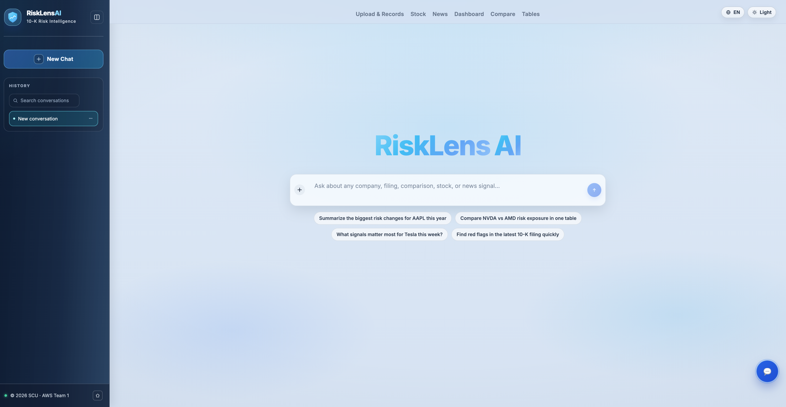

# RiskLensAI (10k-risk-evolution)

RiskLensAI is an AI-powered SEC 10-K risk intelligence platform.
It extracts and structures Item 1A risk factors, compares filings across years/companies, and visualizes risk pressure in dashboard views.

A core strength of the project is its **multi-step ReAct Agent**:
- Orchestrates multi-tool reasoning for risk Q&A
- Combines filing risk data, compare results, stock context, and news signals
- Produces concise, context-aware answers for analysts and product users

## Links

- Product Homepage: [risklens-ai.pages.dev](https://risklens-ai.pages.dev)

## Product Preview

